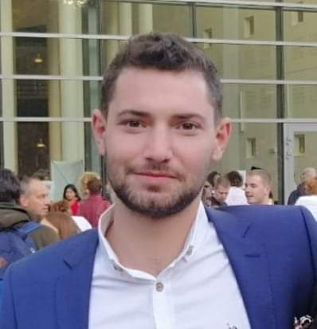

# Ibrahim Shoaib
*You're only given a little spark of madness. You mustn't lose it.*

## Me, in one sentence

28 years old young man who will be a brilliant web dev.

| Birthday | Favourite color | Favourite Food | Pineapple on pizza |
| :-: | :-: | :-: | :-: |
| 21 March | RED | Falafel | <ul><li>- [x] NO</li><li>- [x] HELL NO</li></ul> |

### Hobbies

- Photography 
- Frisbee 
- Fifa 
- Beer
  - Triple Karmeliet
  - Duvel Tripel hop
  

#### You can always count on me to take care of your cat.

I can be useful to the team with my positive vibes.

##### A funny story
Ibrahim had always loved Ancient Baghdad with its decomposing, distinct Desert. It was a place where he felt puzzled.

He was a cold-blooded, scheming, wine drinker with brown toenails and tall toes. His friends saw him as a mashed, mouldy monster. Once, he had even made a cup of tea for a xanthic baby flamingo. That's the sort of man he was.

Ibrahim walked over to the window and reflected on his Historical surroundings. The rain hammered like skipping tortoises.

Then he saw something in the distance, or rather someone. It was the figure of Saddam Hussein. Saddam was a virtuous volcano with ginger toenails and wobbly toes.

Ibrahim gulped. He was not prepared for Saddam.

As Ibrahim stepped outside and Saddam came closer, he could see the muddy smile on his face.

"Look Ibrahim," growled Saddam, with an incredible glare that reminded Ibrahim of virtuous puppies. "I hate you and I want hug. You owe me 1329 pounds."

Ibrahim looked back, even more sneezy and still fingering the silver guillotine. "Saddam, i am your father," he replied.

They looked at each other with happy feelings, like two ripe, resonant rabbits laughing at a very patient wedding, which had flute music playing in the background and two modest uncles bopping to the beat.

Ibrahim regarded Saddam's ginger toenails and wobbly toes. "I don't have the funds ..." he lied.

Saddam glared. "Do you want me to shove that silver guillotine where the sun don't shine?"

Ibrahim promptly remembered his cold-blooded and scheming values. "Actually, I do have the funds," he admitted. He reached into his pockets. "Here's what I owe you."

Saddam looked calm, his wallet blushing like a petite, prickly piano.

Then Saddam came inside for a nice glass of wine.

THE END

###### TL;DR
Cold-blooded Ibrahim

<<[PREVIOUS](https://github.com/GemaHonesta/markdownchallenge/edit/master/README.md) ||IBRAHIM|| [NEXT](https://github.com/JPalluel/markdown-challenge/blob/master/README.md)>>

